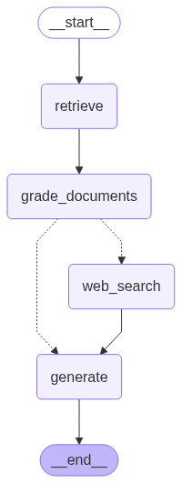
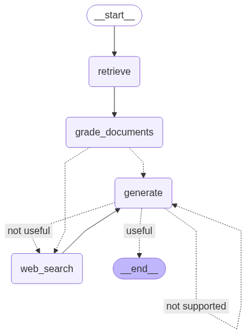
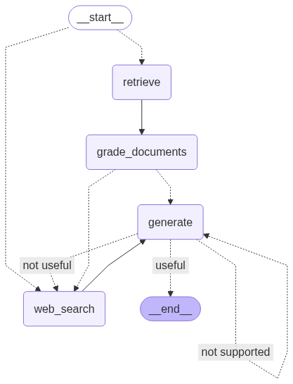

# Agentic RAG Project

[](https://www.python.org/) 
[](https://www.tavily.com/) 
[](https://app.pinecone.io/organizations/-OQOYTa7PD5A_F9pFlNC/projects/0fed2f10-ab48-4302-a34b-583868c23c78/indexes/agentic-rag/browser) 
[](https://smith.langchain.com/o/856312b1-7816-4389-80cb-b01e398655be/projects/p/ffa08a3c-8ca2-4ade-8271-25651d6c74ab?timeModel=%7B%22duration%22%3A%227d%22%7D) 
[](LICENSE) 

Builds an **agent‑based Retrieval‑Augmented Generation (RAG)** system that can dynamically switch between three complementary RAG strategies—**Corrective RAG, Self RAG, and Adaptive RAG**—using [LangGraph](https://python.langchain.com/docs/langgraph/) state‑machines on top of LangChain.


## Table of Contents
- [1. Key ideas](#1-key-ideas)  
- [2. Project structure](#2-project-structure)  
- [3. Quick start](#3-quick-start)  
- [4. Why this matters](#4-why-this-matters)  
- [5. References](#5-references)


---

## 1. Key ideas

| Strategy           | What it does                                                                                                                              | Where it is applied                           |
| ------------------ | ----------------------------------------------------------------------------------------------------------------------------------------- | --------------------------------------------- |
| **Corrective RAG** | Grades every retrieved chunk and drops the irrelevant ones; if too much noise remains it falls back to web‑search.                        | `grade_documents` → `generate` / `web_search` |
| **Self RAG**       | Lets the generator critique its own answer for grounding & usefulness; it will try again (or go to web search) until the answer is solid. | `generate` conditional edges                  |
| **Adaptive RAG**   | A router decides *before* retrieval whether the query should go to the vector store or straight to web search.                            | Conditional entry‑point `route_question`      |

The result is an **end‑to‑end autonomous agent** that (1) decides data‑source, (2) filters noise, (3) self‑checks hallucinations, and (4) retries or corrects itself when needed.

Diagrams for each flow are auto‑exported by `graph/graph.py` and stored in the repo:


<p align="center">
  
  
  
</p>


---

## 2. Project structure

<details>
<summary><strong>Top‑level files</strong></summary>

| Path                             | Purpose                                                                                                                                                                                                                                         |
| -------------------------------- | ----------------------------------------------------------------------------------------------------------------------------------------------------------------------------------------------------------------------------------------------- |
| **`main.py`**                    | Small playground that invokes the graph with several example questions, one line per RAG flavour. ([raw.githubusercontent.com](https://raw.githubusercontent.com/ndkhoa211/agentic_rag_project/main/main.py))                                   |
| **`ingestion.py`**               | Loads a few Lilian Weng blog posts, splits them, and indexes them in Pinecone; exposes a `retriever` object used by the graph. ([raw.githubusercontent.com](https://raw.githubusercontent.com/ndkhoa211/agentic_rag_project/main/ingestion.py)) |
| **`pyproject.toml` / `uv.lock`** | Reproducible dependencies; use `uv pip install -r` for fast, isolated installs.                                                                                                                                                                 |
| **`LICENSE`**                    | MIT License.                                                                                                                                                                                                                                    |

</details>

<details>
<summary><strong>`graph/` package</strong></summary>

| File / Dir                    | What it contains                                                                                                                                                                                           |
| ----------------------------- | ---------------------------------------------------------------------------------------------------------------------------------------------------------------------------------------------------------- |
| **`graph.py`**                | Assembles the LangGraph **state machine** and draws the Mermaid diagrams. ([raw.githubusercontent.com](https://raw.githubusercontent.com/ndkhoa211/agentic_rag_project/main/graph/graph.py))               |
| **`state.py`**                | TypedDict that defines the shared state keys (`question`, `documents`, etc.). ([raw.githubusercontent.com](https://raw.githubusercontent.com/ndkhoa211/agentic_rag_project/main/graph/state.py))           |
| **`consts.py`**               | Centralised node‑name constants to avoid typos. ([raw.githubusercontent.com](https://raw.githubusercontent.com/ndkhoa211/agentic_rag_project/main/graph/consts.py))                                        |
| **`nodes/`**                  | Single‑responsibility functions that mutate the graph state:                                                                                                                                               |
|   • `retrieve.py`             | Semantic search against Pinecone. ([raw.githubusercontent.com](https://raw.githubusercontent.com/ndkhoa211/agentic_rag_project/main/graph/nodes/retrieve.py))                                              |
|   • `grade_documents.py`      | LLM grader that filters irrelevant docs and sets the `web_search` flag. ([raw.githubusercontent.com](https://raw.githubusercontent.com/ndkhoa211/agentic_rag_project/main/graph/nodes/grade_documents.py)) |
|   • `web_search.py`           | Runs a Tavily search and appends the results to the context. ([raw.githubusercontent.com](https://raw.githubusercontent.com/ndkhoa211/agentic_rag_project/main/graph/nodes/web_search.py))                 |
|   • `generate.py`             | Final answer generation chain. ([raw.githubusercontent.com](https://raw.githubusercontent.com/ndkhoa211/agentic_rag_project/main/graph/nodes/generate.py))                                                 |
| **`chains/`**                 | Re‑usable LangChain pipelines:                                                                                                                                                                             |
|   • `generation.py`           | RAG prompt → GPT‑4 mini → string output. ([raw.githubusercontent.com](https://raw.githubusercontent.com/ndkhoa211/agentic_rag_project/main/graph/chains/generation.py))                                    |
|   • `retrieval_grader.py`     | Binary *relevance* classifier for each chunk. ([raw.githubusercontent.com](https://raw.githubusercontent.com/ndkhoa211/agentic_rag_project/main/graph/chains/retrieval_grader.py))                         |
|   • `hallucination_grader.py` | Binary *groundedness* checker. ([raw.githubusercontent.com](https://raw.githubusercontent.com/ndkhoa211/agentic_rag_project/main/graph/chains/hallucination_grader.py))                                    |
|   • `answer_grader.py`        | Binary *question‑answered?* checker. ([raw.githubusercontent.com](https://raw.githubusercontent.com/ndkhoa211/agentic_rag_project/main/graph/chains/answer_grader.py))                                     |
|   • `router.py`               | Decides between vector store vs. web search. ([raw.githubusercontent.com](https://raw.githubusercontent.com/ndkhoa211/agentic_rag_project/main/graph/chains/router.py))                                    |

</details>

---

## 3. Quick start

```bash
# 1. Clone
$ git clone https://github.com/ndkhoa211/agentic_rag_project && cd agentic_rag_project

# 2 Create isolated env & install deps — all with **uv**
$ uv venv                       # create virtual env (Python 3.11)
$ source .venv/bin/activate     # on Windows: .venv\Scripts\activate
$ uv pip install -r pyproject.toml  # lock‑file aware install

# 3. Set environment secrets (OpenAI, Pinecone, Tavily)
$ export OPENAI_API_KEY=...
$ export PINECONE_API_KEY=...
$ export TAVILY_API_KEY=...

# 4. (Optional) run first‑time ingestion
$ python ingestion.py

# 5. Ask questions
$ python main.py
```

> **Tip:** In a notebook or REPL you can `import graph` and call:
>
> ```python
> graph.invoke({"question": "Explain the fast inverse square root trick"})
> ```

---

## 4. Why this matters

* **Reliability first** – Every answer is checked twice (document relevance + hallucination/self‑grade) before it leaves the graph.
* **Cost aware** – The router avoids expensive vector search when the question is clearly out‑of‑scope.
* **Extensible** – Add new graders or tools by dropping a new node and edge into `graph.py`.


## 5. References

* Lilian Weng’s blog posts on [agents](https://lilianweng.github.io/posts/2023-06-23-agent/), [prompt engineering](https://lilianweng.github.io/posts/2023-03-15-prompt-engineering/), and [adversarial attacks](https://lilianweng.github.io/posts/2023-10-25-adv-attack-llm/).
* **Self‑RAG:** Shibui et al., 2023 ([arXiv 2310.11511](https://arxiv.org/abs/2310.11511)).
* **Corrective RAG:** Yan et al., 2024 ([arXiv 2401.15884](https://arxiv.org/abs/2401.15884)).
* **Adaptive RAG:** Soyeong Jeong et al., 2024([arXiv 2403.14403](https://arxiv.org/abs/2403.14403)).
* [LangGraph documentation](https://python.langchain.com/docs/langgraph).

---

<sup>© 2025 MIT License.</sup>
